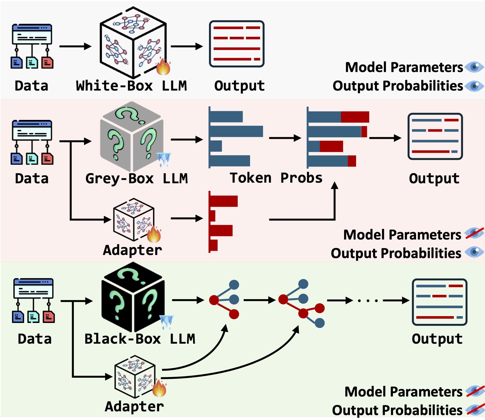
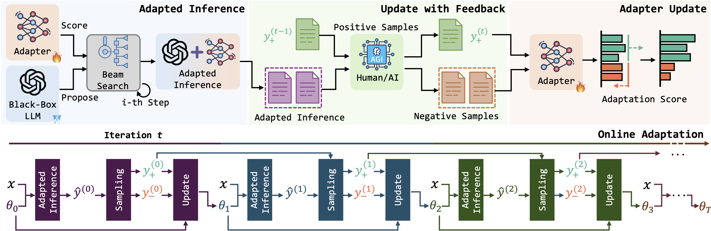
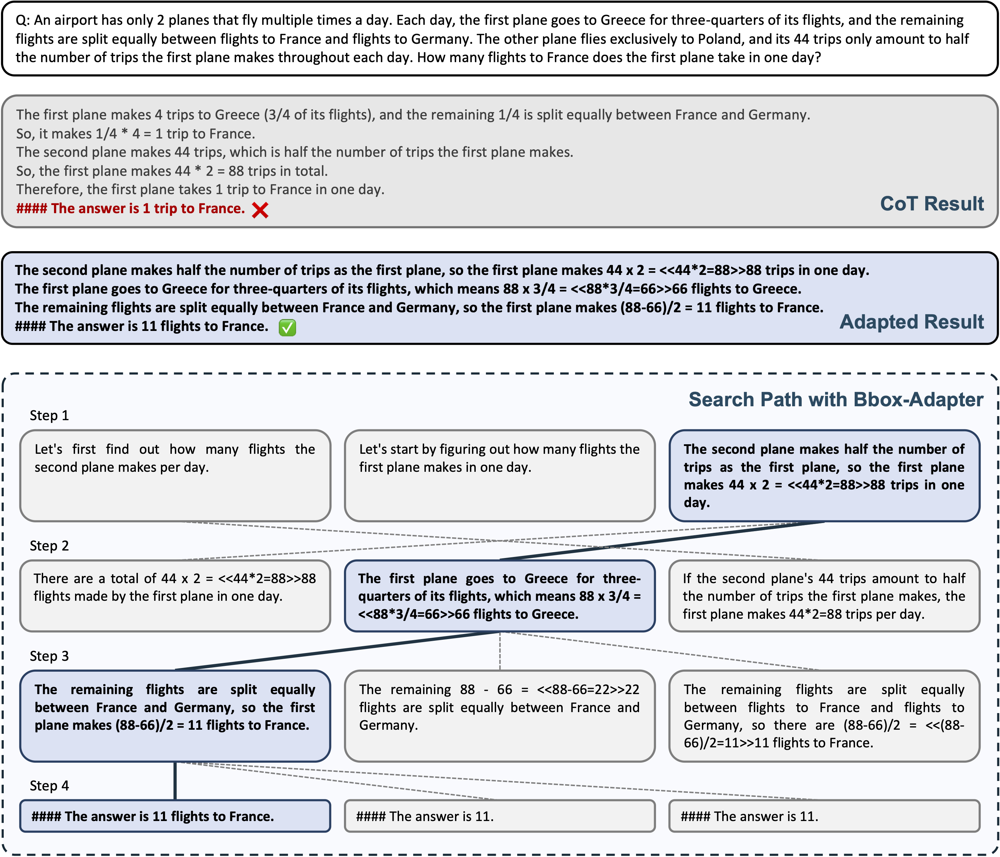

# BBox-Adapter

[arXiv] [BBox-Adapter: Lightweight Adapting for Black-Box Large Language Models](https://arxiv.org/abs/2402.08219)

[Website] [BBox-Adapter Project](https://haotiansun14.github.io/BBox-Adapter-page/)

## Abstract

Adapting state-of-the-art Large Language Models (LLMs) like GPT-4 and Gemini for specific tasks is challenging. Due to the opacity in their parameters, embeddings, and even output probabilities, existing fine-tuning adaptation methods are inapplicable. Consequently, adapting these black-box LLMs is only possible through their API services, raising concerns about transparency, privacy, and cost. To address these challenges, we introduce BBox-Adapter, a novel lightweight adapter for black-box LLMs. BBox-Adapter distinguishes target and source domain data by treating target data as positive and source data as negative. It employs a ranking-based Noise Contrastive Estimation (NCE) loss to promote the likelihood of target domain data while penalizing that of the source domain. Furthermore, it features an online adaptation mechanism, which incorporates real-time positive data sampling from ground-truth, human, or AI feedback, coupled with negative data from previous adaptations. Extensive experiments demonstrate BBox-Adapter's effectiveness and cost efficiency. It improves model performance by up to 6.77% across diverse tasks and domains, while reducing training and inference costs by 31.30x and 1.84x, respectively.

## Introduction

Adapting black-box LLMs through fine-tuning APIs has several critical issues on transparency, privacy, and cost. The adaptation of black-box LLMs without the use of APIs remains an *unresolved* challenge.



Due to the black-box nature, users are unable to access

- internal model parameters,
- high-dimensional representations of input sequences or output generations, and
- output token probabilities for their specific use cases in black-box adaptation.

Notably, existing methods, except ours, fail to support **black-box** LLM adaptations, where neither model parameters nor output probabilities can be accessed in most recent LLMs like GPT-3.5 and Gemini.



BBox-Adapter is a lightweight adapter that adapts black-box LLMs for specific tasks by fine-tuning a smaller language model with just 0.1B-0.3B parameters. We formulate the black-box LLM adaptation process as a sampling problem from an energy-based model (EBM). To effectively distinguish between source and target domain data, we design a ranking-based noise contrastive estimation (NCE) loss for adapter updates. We combine outputs from the black-box LLM and the adapter for adaptive inference. BBox-Adapter employs an online adaptation framework, iteratively sampling from previous inferences and updating the adapter. Notably, the adapter facilitates self-improvement through AI feedback during training, reducing the reliance on ground-truth training data as positive samples in the online adaptation process.



Here is a case study of BBox-Adapter on GSM8K. For the given question, the CoT solution from original gpt-3.5-turbo is incorrect, while the model adapted using BBox-Adapter successfully executed a logical, step-by-step search, ultimately yielding the correct answer. For clarity, we display only the top-3 candidate answers at each step.

## Setups
You need to get an OpenAI API key and store it in the environment variable identified as `OPENAI_API_KEY`.

### Package Installation
The required packages are listed as follows:
- `python` >= 3.10
- `torch` >= 2.1.2
- `numpy` >= 1.24.3
- `transformers` >= 4.37.2
- `accelerate` >= 0.27.2
- `datasets` >= 2.17.0
- `openai` >= 1.12.0
- `PyYAML` >= 6.0.1
- `tenacity` >= 8.2.3
- `tqdm` >= 4.66.1

You can install the required packages by running the following command:
`pip install -r requirements.txt`


### Experiments
The experiments are conducted on the following datasets: `gsm8k`, `strategyqa`, `scienceqa`, and `truthfulqa`. The configurations for the experiments are stored in the `configs` directory.

To run the experiments, you can use the following commands:

`accelerate launch --mixed_precision fp16 main.py --config configs/{task_name}.yaml`

where `{task_name}` is one of `gsm8k`, `strategyqa`, `scienceqa`, and `truthfulqa`.

### Judge Model for TruthfulQA
We fine-tune davinci as the judge model for TruthfulQA. Please follow the instructions on [TruthfulQA Github Repo](https://github.com/sylinrl/TruthfulQA) to fine-tune the judge model for your own use.

## Citation
If you find our work helpful, please consider citing our paper:

```
@misc{sun2024bboxadapter,
      title={BBox-Adapter: Lightweight Adapting for Black-Box Large Language Models}, 
      author={Haotian Sun and Yuchen Zhuang and Wei Wei and Chao Zhang and Bo Dai},
      year={2024},
      eprint={2402.08219},
      archivePrefix={arXiv},
      primaryClass={cs.CL}
}
```
